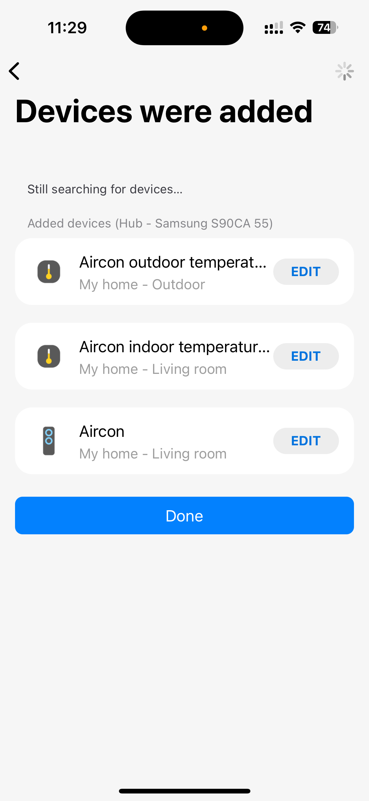
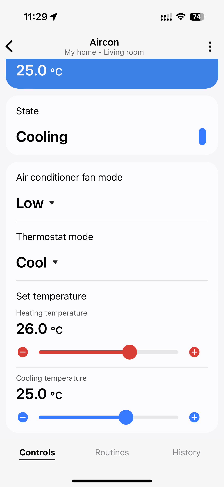

<div align="center">    
 
 
 
 
</div>

# Daikin Airbase BRP15B61 edge handler for SmartThings

| Device discovery | Main unit | Temperature sensor |
|---|---|---|
|  |  |  |

### Disclaimer
All product and company names or logos are trademarks™ or registered® trademarks of their respective holders. 
Their use does not imply affiliation with or endorsement by them or any associated subsidiaries!
**Daikin** is a trademark of **Daikin Industries, Ltd**. **Smartthings** is a trademark of **SmartThings Inc.** a subsidiary of **Samsung Electronics**.

This personal project has an educational context, is developed as a proof of concept, and has no business goal.
The author is not responsible for the harm or damage caused by using this software. You may use it at your own risk and responsibility only.

### Resources
https://github.com/ael-code/daikin-control
https://github.com/Apollon77/daikin-controller
https://developer.smartthings.com/docs/edge-device-drivers/
https://developer.smartthings.com/docs/devices/hub-connected/edge-architecture
https://developer.smartthings.com/docs/devices/hub-connected/first-lua-driver
https://developer.smartthings.com/docs/devices/capabilities/capabilities-reference
https://developer.smartthings.com/docs/devices/capabilities/custom-capabilities
https://community.smartthings.com/t/tutorial-writing-an-rpc-client-edge-device-driver/230285
https://community.smartthings.com/t/tutorial-creating-drivers-for-lan-devices-with-smartthings-edge/229501

### Dependencies
https://developer.smartthings.com/docs/sdks/cli/introduction
https://github.com/SmartThingsCommunity/SmartThingsEdgeDrivers/releases/tag/apiv9_52

### Installation
#### Uploading Your Driver to SmartThings

```bash
smartthings edge:channels:create
```
```text
? Channel name: Daikin-Airbase-BRP15B61
? Channel description: Daikin Airbase BRP15B61
? Channel terms of service URL: https://community.smartthings.com
────────────────────────────────────────────────────────────
Channel Id            debeba40-9bc2-47fe-94fb-90769cec8730
Name                  Daikin-Airbase-BRP15B61
Description           Daikin Airbase BRP15B61
Type                  DRIVER
Terms Of Service URL  https://community.smartthings.com
Created Date          2024-09-11T09:54:45.404472626Z
Last Modified Date    2024-09-11T09:54:45.404472934Z
────────────────────────────────────────────────────────────
```
```bash
smartthings edge:channels:enroll
```
```text
──────────────────────────────────────────────────────────────────
#  Name                     Channel Id
──────────────────────────────────────────────────────────────────
1  Daikin-Airbase-BRP15B61  debeba40-9bc2-47fe-94fb-90769cec8730
──────────────────────────────────────────────────────────────────
? Select a channel. 1
──────────────────────────────────────────────────────────────────────────────────
#  Label                   Name             Device Id
──────────────────────────────────────────────────────────────────────────────────
1  Hub - Samsung S90CA 55  SmartThings Hub  4c83ac01-c974-41b4-8f81-51429c21e4a9
──────────────────────────────────────────────────────────────────────────────────
? Select a hub. 1
? Do you want to save this as the default? Yes
4c83ac01-c974-41b4-8f81-51429c21e4a9 is now the default.
You can reset these settings using the config:reset command.
4c83ac01-c974-41b4-8f81-51429c21e4a9 enrolled in channel debeba40-9bc2-47fe-94fb-90769cec8730
```
```bash
smartthings edge:channels:assign
```
```text
──────────────────────────────────────────────────────────────────
#  Name                     Channel Id
──────────────────────────────────────────────────────────────────
1  Daikin-Airbase-BRP15B61  debeba40-9bc2-47fe-94fb-90769cec8730
──────────────────────────────────────────────────────────────────
? Select a channel for the driver. 1
? Do you want to save this as the default? Yes
debeba40-9bc2-47fe-94fb-90769cec8730 is now the default.
You can reset these settings using the config:reset command.
──────────────────────────────────────────────────────────────────
#  Name                     Driver Id
──────────────────────────────────────────────────────────────────
1  Daikin Airbase BRP15B61  cb32c4d5-a7e4-4624-9c4a-e8e8e2b68f87
──────────────────────────────────────────────────────────────────
? Select a driver to assign. 1
cb32c4d5-a7e4-4624-9c4a-e8e8e2b68f87  assigned to channel debeba40-9bc2-47fe-94fb-90769cec8730
```
```bash
smartthings edge:drivers:install
```
```text
using previously specified default hub labeled "Hub - Samsung S90CA 55" (4c83ac01-c974-41b4-8f81-51429c21e4a9)
──────────────────────────────────────────────────────────────────
#  Name                     Channel Id
──────────────────────────────────────────────────────────────────
1  Daikin-Airbase-BRP15B61  debeba40-9bc2-47fe-94fb-90769cec8730
──────────────────────────────────────────────────────────────────
? Select a channel to install the driver from. 1
──────────────────────────────────────────────────────────────────
#  Name                     Driver Id
──────────────────────────────────────────────────────────────────
1  Daikin Airbase BRP15B61  cb32c4d5-a7e4-4624-9c4a-e8e8e2b68f87
──────────────────────────────────────────────────────────────────
? Select a driver to install. 1
driver cb32c4d5-a7e4-4624-9c4a-e8e8e2b68f87 installed to hub 4c83ac01-c974-41b4-8f81-51429c21e4a9
```
#### Accessing live logs
```shell
smartthings edge:drivers:logcat cb32c4d5-a7e4-4624-9c4a-e8e8e2b68f87
```
```text
using previously specified default hub labeled "Hub - Samsung S90CA 55" (4c83ac01-c974-41b4-8f81-51429c21e4a9)
connecting... connected
2024-09-11T20:07:43.524134465+10:00 TRACE Daikin Airbase BRP15B61  Setup driver Daikin Skyfi with lifecycle handlers:
DeviceLifecycleDispatcher: Daikin Skyfi
  default_handlers:
    driverSwitched:
    removed:
    init:
    added:
  child_dispatchers:

2024-09-11T20:07:43.525248723+10:00 TRACE Daikin Airbase BRP15B61  Setup driver Daikin Skyfi with Capability handlers:
CapabilityCommandDispatcher: Daikin Skyfi
  default_handlers:
    refresh:
      refresh
  child_dispatchers:

2024-09-11T20:07:43.525910791+10:00 INFO Daikin Airbase BRP15B61  Created dispatcher [SecretDataDispatcher]Daikin Skyfi that had no handlers
2024-09-11T20:07:43.526587101+10:00 TRACE Daikin Airbase BRP15B61  Setup driver Daikin Skyfi with Secret Data handlers:
SecretDataDispatcher: Daikin Skyfi
  default_handlers:
  child_dispatchers:
```
#### Onboarding your New Device
Open the SmartThings App and go to the Location where the Hub is installed.

- Select Add (+) and then Device
- Tap on “Scan nearby” and check the logs emitted at your logcat session
