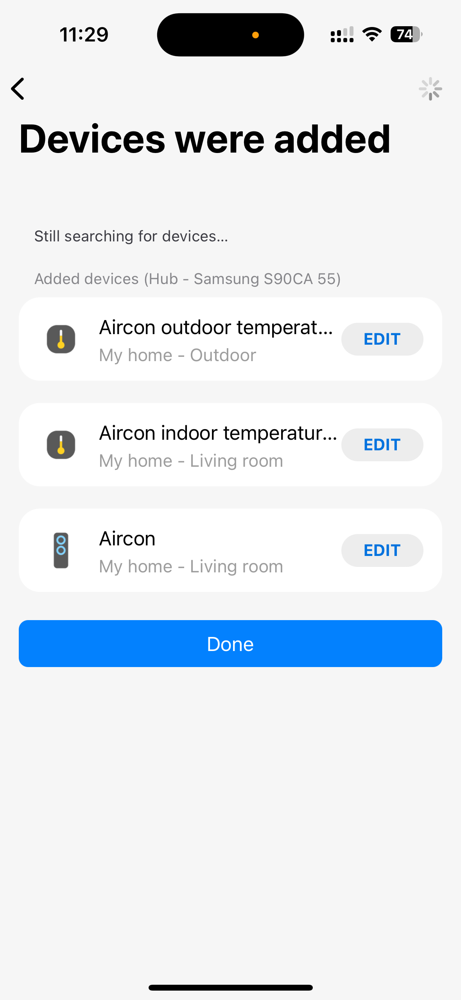
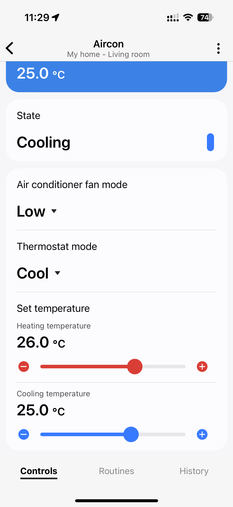
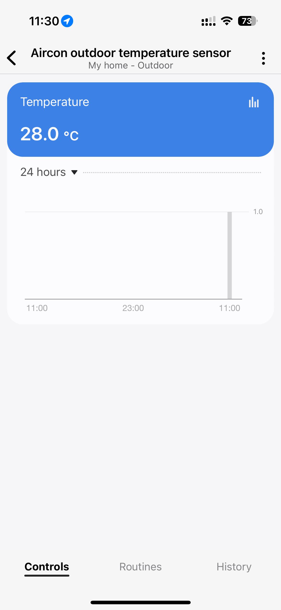

<div style="text-align: center;">    
 
 
 
 
</div>

# Daikin Airbase BRP15B61 Edge Handler for SmartThings

| Device Discovery | Main Unit | Temperature Sensor |
| :---: | :---: | :---: |
|  |  |  |

### Disclaimer

All product and company names or logos are trademarks™ or registered® trademarks of their respective holders. 
Their use does not imply affiliation with or endorsement by them or any associated subsidiaries!
**Daikin** is a trademark of **Daikin Industries, Ltd**. **SmartThings** is a trademark of **SmartThings Inc.** a subsidiary of **Samsung Electronics**.

This personal project has an educational context, is developed as a proof of concept, and has no business goal.
The author is not responsible for the harm or damage caused by using this software. You may use it at your own risk and responsibility only.

### Resources

- [Daikin Control (Node.js)](https://github.com/ael-code/daikin-control)
- [Daikin Controller (Node.js)](https://github.com/Apollon77/daikin-controller)
- [SmartThings Edge Device Drivers](https://developer.smartthings.com/docs/edge-device-drivers/)
- [Edge Architecture](https://developer.smartthings.com/docs/devices/hub-connected/edge-architecture)
- [First Lua Driver Tutorial](https://developer.smartthings.com/docs/devices/hub-connected/first-lua-driver)
- [Capabilities Reference](https://developer.smartthings.com/docs/devices/capabilities/capabilities-reference)
- [Custom Capabilities](https://developer.smartthings.com/docs/devices/capabilities/custom-capabilities)

### Dependencies

- [SmartThings CLI](https://developer.smartthings.com/docs/sdks/cli/introduction)
- [SmartThings Edge Drivers SDK](https://github.com/SmartThingsCommunity/SmartThingsEdgeDrivers/releases/tag/apiv9_52)

### Installation

#### Uploading Your Driver to SmartThings

For a simplified setup, use the provided `Makefile`:
```bash
make setup
```

Or manually follow these steps:

1. **Create a Channel:**
   ```bash
   smartthings edge:channels:create
   ```

2. **Enroll Your Hub:**
   ```bash
   smartthings edge:channels:enroll
   ```

3. **Assign the Driver to the Channel:**
   ```bash
   smartthings edge:channels:assign
   ```

4. **Install the Driver on Your Hub:**
   ```bash
   smartthings edge:drivers:install
   ```

#### Accessing Live Logs

To see what the driver is doing in real-time:
```bash
make logcat
```
Or manually:
```shell
smartthings edge:drivers:logcat
```

### Development

A `Makefile` is provided for common development tasks:
- `make setup`: Run the **full** onboarding flow (First time).
- `make test`: Run Lua unit tests.
- `make package`: Package the driver.
- `make create-channel`: Create a new channel (interactive).
- `make enroll-channel`: Enroll hub in channel (interactive).
- `make assign-driver`: Assign driver to channel (interactive).
- `make install`: Install the driver to the hub.
- `make logcat`: Access live logs.

#### Running Tests
```bash
make test
```

### Onboarding Your New Device

Once the driver is installed on your hub:

1. Open the **SmartThings App**.
2. Go to the **Location** where the Hub is installed.
3. Select **Add (+)** and then **Device**.
4. Tap on **"Scan nearby"**.
5. Check the logs in your `logcat` session to verify discovery.
6. The device should appear in your SmartThings app.

### FAQ: Daikin Airbase with SmartThings Configuration

#### Pre-requisites and Verification

**Q1: What is this guide about?**
A1: This guide helps troubleshoot the setup of a Daikin Airbase unit with a SmartThings hub, using a custom Edge Driver

**Q2: What are the essential verification steps to take before installing the driver?**
A2:

* Ensure your SmartThings Hub and Daikin Airbase are on the same network (BRP15B61 is very picky about the network and may require a 2.4GHz network).
* Make sure you can use the official Daikin App.
* You must know the static IP address of your Daikin Airbase.
* Verify communication by running a `curl` command (e.g., `curl --location 'http://192.168.50.158/skyfi/common/basic_info'`) from your PC, substituting your Airbase's IP address. A successful response confirms that your computer (and the SmartThings hub on the same network) can communicate with the unit, and that your Daikin Airbase version is compatible with the `skyfi` API endpoint.

#### Driver Installation Issues (CLI)

**Q3: I am getting a "no driver found" error during installation via the SmartThings CLI. What might be the cause?**
A3: This error can stem from two main causes:

* **Incorrect Directory:** CLI commands must be run from the root directory of the repo (e.g., `C:\smartthings-daikin-airbase`), not from a system directory (e.g., `C:\WINDOWS\system32`).
* **Missing Driver Package:** Before the channel assignment command (`smartthings edge:channels:assign`), you must package the driver using the command: `smartthings edge:drivers:package .`

**Q4: I packaged the driver and assigned it to a channel, but I still get "no drivers found" on install.**
A4: If you are using the Windows CLI, there might be an issue with the default channel: the `smartthings edge:channels:assign` command might be assigning the driver to a different, default channel, rather than the one you created (`Daikin-Airbase-BRP15B61`). Try to force the correct channel:

1.  Set the correct channel ID as the default:
    ``` 
    smartthings config:default channel <uuid-of-the-channel-you-created>
    
    ```
    (Use the ID of your newly created channel).
2.  Then try assigning the channel again:
    ``` 
    smartthings edge:channels:assign
    
    ```

#### Post-Installation Issues

**Q5: The main controls (on/off) work, but the temperature sensors are reporting incorrect values.**
A5: The built-in temperature sensors in the Daikin Airbase (indoor in the thermostat, outdoor on the unit) may not be reliable or their readings can be confusing. The temperature on the thermostat is the **set temperature**, not the actual room temperature. For reliable automation, it is recommended to use a separate, dedicated temperature sensor.
